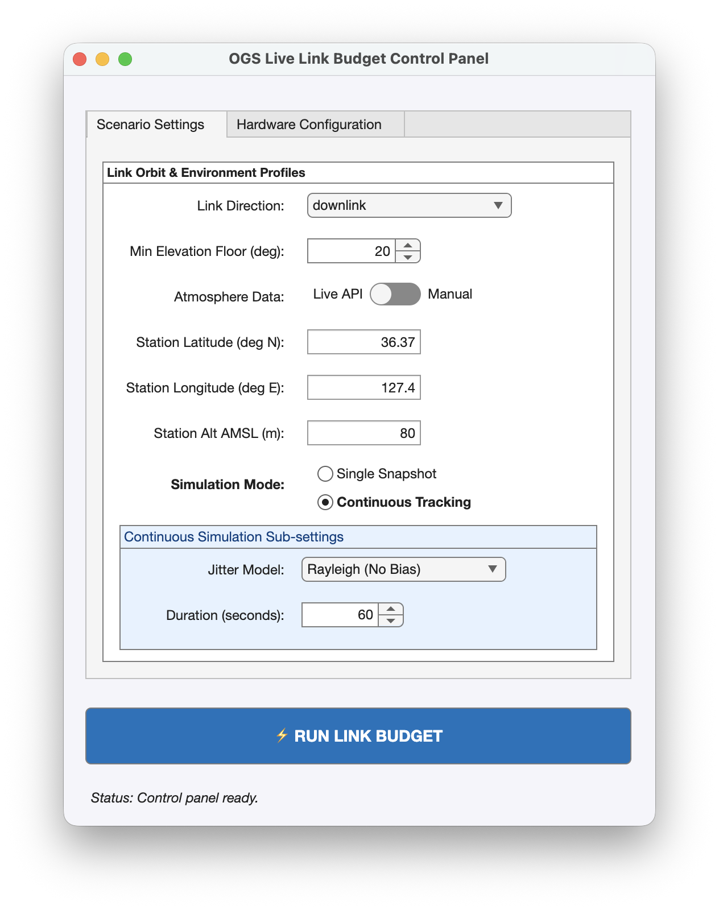
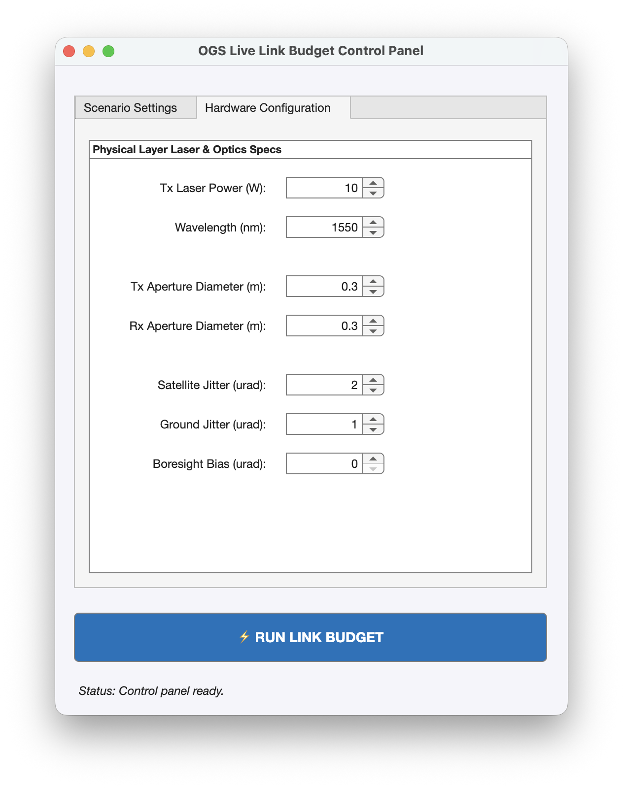
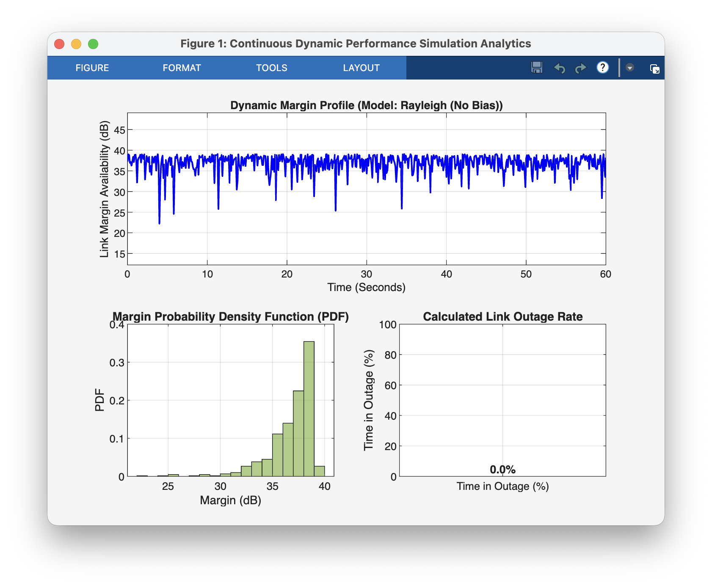

# Optical Ground Station (OGS) Satellite Live Link Budget Simulator

An interactive, multi-tab MATLAB dashboard built with modern UI components (`uifigure`) designed to evaluate the physical layer performance, signal margin, and tracking reliability of free-space optical (laser) communication links between a spacecraft terminal and an Optical Ground Station.

---

## 🛠️ Operational Setup & Input Instructions

The graphical user interface is organized into a clean, two-tab layout designed to isolate environmental orbit profiles from physical laser hardware tuning parameters.

### Tab 1: Scenario Settings
Use this panel to define where the ground station is on Earth, how the satellite passes over it, and how atmospheric losses are evaluated.

1. **Link Direction Dropdown:** Select the orientation of your laser link (`downlink`, `uplink`, or `inter-satellite`).
2. **Min Elevation Floor (deg):** Set the minimum angle above the horizon at which tracking begins. *Engineering tip: Keeping this at $\geq 20^\circ$ helps skip the thickest, high-loss layers of the lower atmosphere.*
3. **Atmosphere Data Slider:** Toggle between **Live API** and **Manual**.
   * **Live API:** Queries real-time local weather reports at your exact coordinates to dynamically scale atmospheric attenuation based on real-world humidity, cloud covers, or precipitations.
   * **Manual:** Bypasses live data networks and locks the simulation to a predictable, clear-sky attenuation baseline (nominal $-3.0\text{ dB}$).
4. **Geodetic Coordinate Overrides:** Type exact numeric values into the **Station Latitude ($^\circ$N)**, **Station Longitude ($^\circ$E)**, and **Station Alt AMSL (m)** fields to pinpoint your custom ground telescope location anywhere on Earth.
5. **Simulation Mode Button Group:** Select **Single Snapshot** for a quick static link budget analysis, or **Continuous Tracking** to model statistical mechanical vibrations over time.
6. **Continuous Simulation Sub-settings:** Adjust the total pass timeline **Duration (seconds)** and choose between **Rayleigh (No Bias)** or **Rician (With Bias)** tracking pointing jitter distributions.

  
   
  <em>Figure 1: Scenario Settings Configuration Interface.</em>

---

### Tab 2: Hardware Configuration
Use this panel to adjust your physical layer hardware properties to overcome high atmospheric losses or pointing errors.

1. **Tx Laser Power (W):** Controls the raw optical output power leaving the transmitter laser assembly.
2. **Wavelength (nm):** Sets the operational laser wavelength (default is standard telecom `1550 nm`).
3. **Tx / Rx Aperture Diameters (m):** Defines the structural sizing of your transmitter and receiver telescope optics. Expanding these elements narrows your beam divergence footprint and gathers more incoming photons.
4. **Satellite Jitter / Ground Jitter ($\mu\text{rad}$):** Defines the mechanical tracking precision limits (fine pointing loop tracking errors) caused by spacecraft attitude adjustments or ground vibrations.
5. **Boresight Bias ($\mu\text{rad}$):** Sets a constant angular alignment offset between the geometric centers of the laser beam and the receiver telescope.

  
   
  <em>Figure 2: Hardware Configuration Parameter Adjustment Panel.</em>

---

## 📊 Real-World Benchmark Scenario & Result Analysis

### 🌍 Validation Setup: SaTReC, KAIST
* **Location:** KAIST Main Campus (Satellite Technology Research Center), Daejeon, South Korea
* **Coordinates Inputted:** `36.37` deg N, `127.36` deg E, Altitude: `80` m
* **Hardware Constraints Set:** Tx Power = `10 W`, Optics Apertures = `0.3 m`, Satellite Jitter = `2.0 urad`, Ground Jitter = `1.0 urad`, Boresight Bias = `0.0 urad`.

Clicking the **⚡ RUN LINK BUDGET** trigger button computes a dynamic time-series performance breakdown across your operational pass tracking window.

  
   
  <em>Figure 3: Analytics Output for a Cloud-Free Continuous Passing Over KAIST.</em>

---

### Detailed Graph Interpretation Guide

When assessing your generated analytics window, evaluate the three core subplots to verify link reliability:

#### 1. Dynamic Margin Profile (Top Main Timeline Plot)
* **What it shows:** A continuous tracking array mapping the calculated link margin (in dB) across your execution window against a strict horizontal red dashed **Link Outage Threshold (0 dB)** line.
* **How to interpret:** The high-frequency jagged variations represent real-time fine pointing tracking dropouts caused by mechanical vibrations ($\sigma_{sat}, \sigma_{ogs}$). As long as the blue line rides securely **above 0 dB**, your link maintains complete data packet lock. Any dip **below 0 dB** represents a link blackout where received photons fall below your detector's optical sensitivity limit ($P_{req}$).

#### 2. Margin Probability Density Function (Bottom-Left Histogram)
* **What it shows:** A statistical histogram illustrating the probability distribution profile of your signal margins throughout the satellite's pass.
* **How to interpret:** A centered, narrow bell curve clustered deep within positive values (e.g., $+30\text{ to }+40\text{ dB}$) indicates an exceptionally stable pointing lock. If you introduce a **Boresight Bias**, the entire histogram distribution moves left toward the danger zone, providing a visual gauge of your system's alignment safety margins.

#### 3. Calculated Link Outage Rate (Bottom-Right Bar Chart)
* **What it shows:** An aggregated summary bar presenting the exact percentage of total tracking time that your link suffered a blackout (Margin $< 0\text{ dB}$).
* **How to interpret:** * **0.0% Outage:** Engineering optimum. Your hardware configuration successfully clears all atmospheric attenuations and mechanical pointing vibrations.
  * **Greater than 0% Outage:** This represents immediate data loss. If you get a high outage rate (e.g., $80\% - 100\%$) when using the **Live API** mode during rainy conditions in Daejeon, it means the physical clouds are scattering your optical beam. To fix this, switch your site coordinates to an alternative, clear-weather ground station location or toggle to **Manual** mode to isolate and test your raw mechanical tracking properties under clear skies.