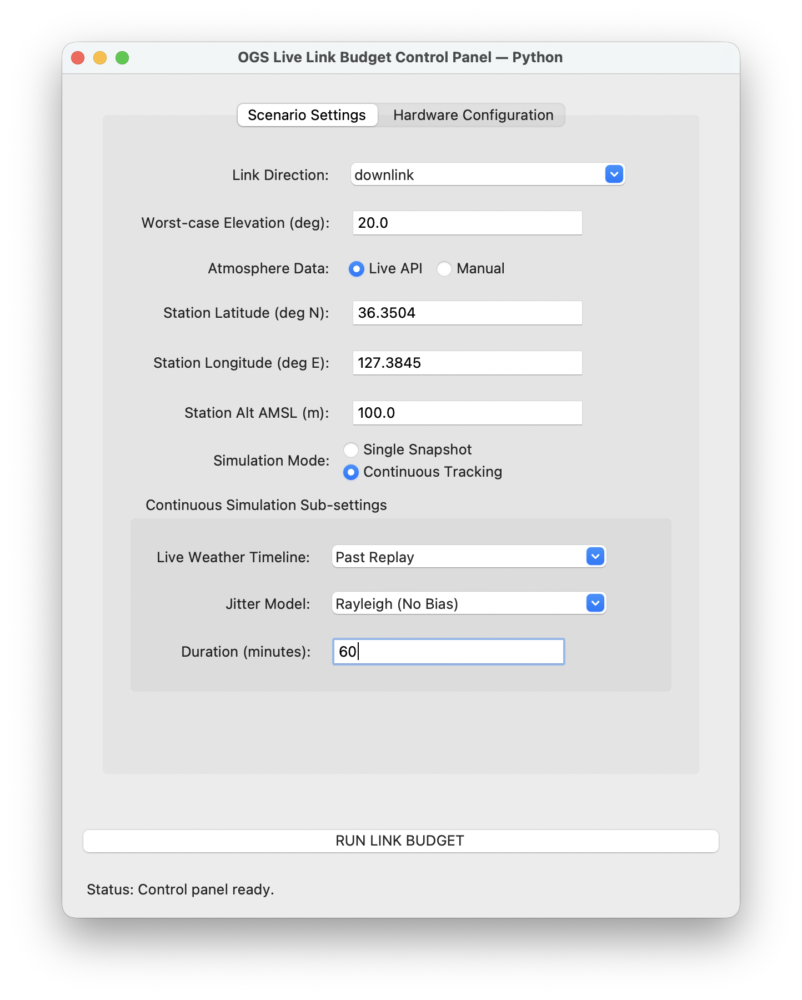
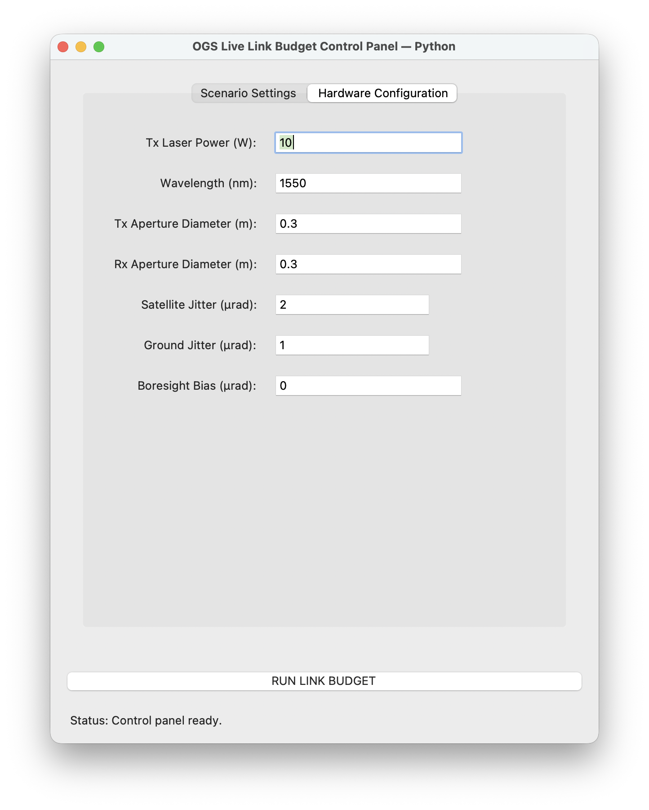
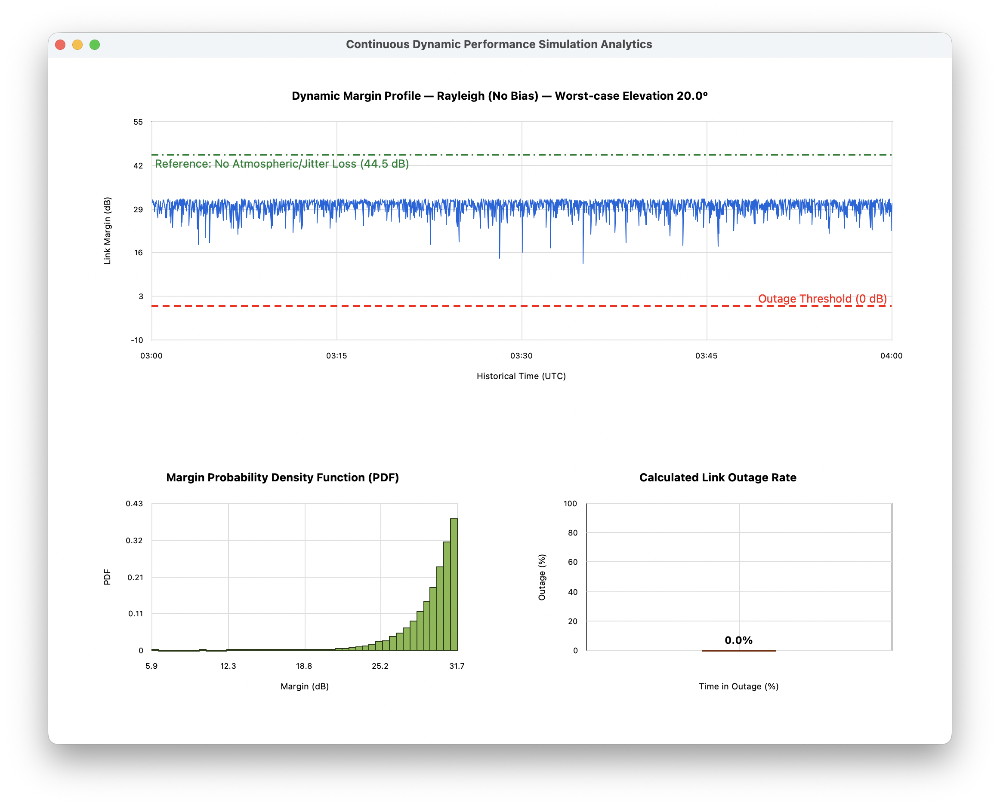

# Python Simulator

This folder contains a standard-library Python version of the optical link-budget simulator. It follows the same scenario, hardware, atmospheric-loss, snapshot, continuous-jitter, and outage models as the MATLAB application.

## Requirements

- Python 3.10 or newer
- Tkinter, which is included with the standard Python installers from [python.org](https://www.python.org/downloads/)
- Internet access when **Live API** weather is selected

No `pip` packages, virtual environment, MATLAB installation, or API key are required.

## Run from a downloaded ZIP

1. Download and extract the project ZIP.
2. Open Terminal or Command Prompt in the extracted project folder.
3. Run:

```bash
python3 python/run.py
```

On Windows, use this command if `python3` is not recognized:

```powershell
py python\run.py
```

## Features

- Downlink, uplink, and inter-satellite links
- User-selected worst-case elevation for ground-space links
- Manual weather or live Open-Meteo conditions
- Past Replay and Current Hold continuous weather timelines
- Rayleigh and Rician randomized pointing jitter
- Ideal no-weather/no-jitter reference margin
- Dynamic margin, probability-density, and outage charts

Each continuous run creates a fresh random jitter sequence. No seed is requested from the user.

## Interface

The Scenario Settings tab selects the link direction, conservative elevation, weather source, station location, simulation mode, weather timeline, pointing model, and duration.

<p align="center">
  
  <br>
  <em>Python scenario and continuous-simulation controls.</em>
</p>

The Hardware Configuration tab defines transmitter power, wavelength, terminal apertures, jitter, and optional Rician boresight bias.

<p align="center">
  
  <br>
  <em>Python optical hardware and pointing controls.</em>
</p>

Continuous simulations display the randomized link-margin profile, the ideal no-weather/no-jitter reference, the `0 dB` outage threshold, the margin probability density, and the calculated outage rate.

<p align="center">
  
  <br>
  <em>Python continuous link-margin and outage analytics.</em>
</p>

## Run the tests

From the project folder:

```bash
python3 -m unittest discover -s python/tests -t python
```

The test suite uses only local data and does not require an internet connection.
